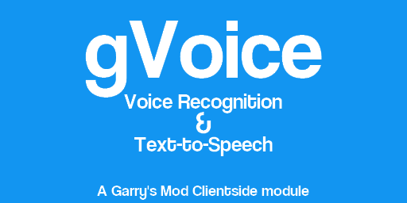

gVoice
================



Simple wrapper around the .NET `System.Speech` API (**Windows Only**)

## How to install
- Install the .gma to your garrysmod/addons directory (or use the Workshop version)
- Put the .dll into your garrysmod/lua/bin directory
**NOTE: Use the win32 dll if you use 32-bit Garry's Mod !**

## Features
- Basic text to speech
- Basic text recognition

## How to use

### Basic setup
To use any gvoice function, you need to `require` it: `require("gvoice")`
After that, you can implement the `GVoice.LogImpl` hook so that you can recieve GVoice log messages:
```lua
hook.Add("GVoice.LogImpl", "GVoiceLogImplHandler", function(msg, r, g, b, a)
    MsgC(Color(r, g, b, a), "[GVoice] ".. msg.."\n")
end)
```

### Text recognition

```lua
-- Init text recognition with the fr-FR culture (requires the fr-FR Windows language pack!)
-- Always specifiy cultures with this format (ab-CD)
gvoice.InitRecognition("fr-FR")

-- Start listening
gvoice.StartRecognition()

-- Called when speech is recognized
hook.Add("GVoice.OnSpeechRecognized", "OnSpeechRecognizedHandler", function(text)
   print(text)
end)

-- We want to flush the recognition queue each frame
hook.Add("Think", "GVoiceUpdate", function()
    gvoice.FlushRecognitionQueue()
end)
```

You can later one stop the recognition
```lua
gvoice.StopRecognition()
```

#### Custom recognition

You can use custom words/sentences to have a more accurate recognition if you only need to listen for a specific subset of words/sentences.
```lua
gvoice.InitRecognition("fr-FR", { "Baguette", "Bonjour", "Comment allez-vous ?" })
```

### Text to speech

```lua
--- Genders
gvoice.Undefined = 0
gvoice.Male = 1
gvoice.Female = 2
gvoice.Neutral = 3

--- Ages
gvoice.Undefined = 0
gvoice.Child = 10
gvoice.Teen = 15
gvoice.Adult = 30
gvoice.Senior = 65

-- Say "Hello" using a Male Senior voice at Rate 1, volume 100
gvoice.Speak("Hello !", 100, 1, gvoice.Male, gvoice.Senior)
```

## Credits
Zino - C++ module

Nogitsu - Helping with logics and API (en plus c un bg)
